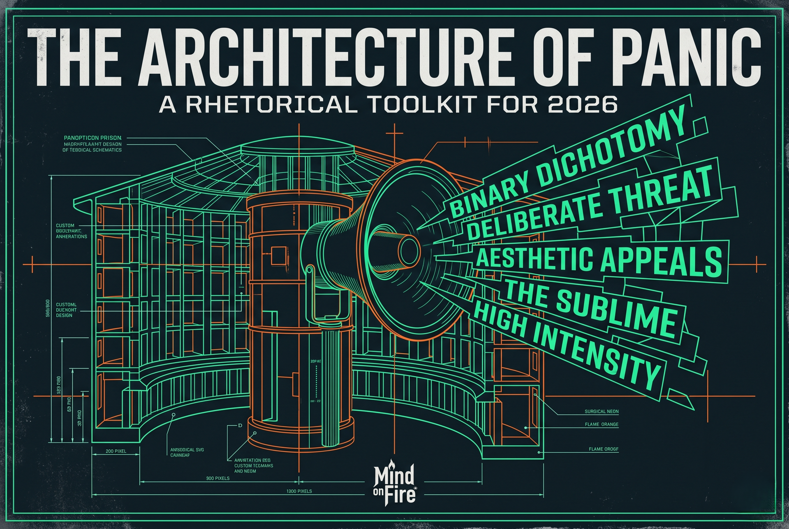

# ⚡ KERNEL PANIC & MULTI-OS ARCHITECTURES
### Master Operating Systems Internals, Forensics & Comparative Architecture Knowledge Vault
### 58 Technical Deep-Dive Guides · 11 Architectural Visual Blueprints · Dual-Intelligence Audit Suite

[]()
[]()
[]()
[]()
[]()
[]()

---

## 🧭 Áttekintés / Project Overview

Ez a repository a **számítógépes operációs rendszerek belső architektúrájának, kernel-mechanizmusainak, összeomlás-forenzikájának és összehasonlító elemzésének** mesterszintű tudástára.

A tudástár 4 fő könyvtárból és 69 hitelesített elemből áll:
1. [**`.he!estor/`**](.he!estor) — **32 db Linux Kernel mélyfúrás:** Kernel Panic taxonómia, kdump/vmcore törvényszéki elemzés, QEMU/GDB laboratórium, KGDB/KDB soros hibakeresés, eBPF/bpftrace, DMA & IOMMU izoláció, valós idejű ütemezés, KASLR/KPTI biztonsági mechanizmusok és live patching.
2. [**`.mac!narumi/`**](.mac!narumi) — **13 db Multi-OS Gyakorlati Útmutató:** 13 különböző operációs rendszer (Windows NT, FreeDOS, DOS, Plan 9, Inferno, Haiku, ReactOS, OpenVMS, Syllable, MenuetOS, AROS, Genode) gyakorlati telepítési, kezelési és üzemeltetési terepi leírása.
3. [**`.macinarium-stellar/`**](.macinarium-stellar) — **13 db Multi-OS Architektúra Deep-Dive:** Rendszerarchitektúra elemzések mikrokernelekről, monolitikus kernelekről, elosztott rendszerekről (Plan 9, Inferno 9P), képességalapú biztonságról (Genode), Amiga klónokról (AROS), tisztán assembly rendszerekről (MenuetOS), valamint történelmi ipari rendszerekről (OpenVMS, OS/2, BeOS).
4. [**`.architech/`**](.architech) — **11 db Rendszerarchitektúra Infografika és Műszaki Blueprint:** UNIX/Linux belső térképek, folyamat-topológiák és a [The Architecture of Panic](.architech/The-Architecture-of-Panic-How-to-Spot-the-Gears-of-Modern-Fear-2060245017.png) infografika.

---

## 🔬 A Dual-Intelligence Elemzési Keretrendszer

A teljes tároló a **Kettős Intelligencia (Dual-Intelligence)** modell szerint lett auditálva és hitelesítve:
- **Engine 1: Determinisztikus Statikus Elemző Motor:**  
  100%-os Markdown AST fa-elemzés, 178 kódblokk határoló és szintaxis ellenőrzés, HTML5 zártság (0 unclosed tag), SHA-256 kriptográfiai leltár, 29 procfs és 15 sysfs elérési út ellenőrzése.
- **Engine 2: Kognitív Rendszermérnöki Motor:**  
  Mély operációs rendszer és kernel invariáns-vizsgálat. Az audit során feltárt 10 technikai anomáliát (pl. a QEMU gazdagép-felülírási kockázatát, az invertált Seccomp BPF ugrási táblát, a SMAP-sértő mutatókezelést, elavult 2.4-es verziószámozási mítoszt) a forrásdokumentumokban **azonnal és maradéktalanul kijavítottuk**.

👉 **Részletes interaktív jelentés:** [`AUDIT_MASTER_REPORT.html`](AUDIT_MASTER_REPORT.html)  
👉 **Műszaki katalógus és SHA-256 jegyzék:** [`INDEX.md`](INDEX.md) | [`MANIFEST.json`](MANIFEST.json)

---

## 🗺️ Fő Architektúra Modell / Visual Blueprint



További architektúra térképek az [`.architech/`](.architech/) mappában:
- [`Linux_kernel_map.png`](.architech/Linux_kernel_map.png) — Teljes Linux Kernel alrendszer-térkép
- [`structure-of-unix-kernel-l.jpg`](.architech/structure-of-unix-kernel-l.jpg) — Klasszikus UNIX rendszermag felépítés

---

## 📚 Modul Struktúra és Témakörök

### A. Linux Kernel Deep-Dive (`.he!estor/`)
- **Pánik és Hibaelemzés:** [`01_kernel_panic_taxonomy.md`](.he!estor/01_kernel_panic_taxonomy.md), [`kernel_crash_dump_analysis.md`](.he!estor/kernel_crash_dump_analysis.md), [`kernel_panic_practical_handling.md`](.he!estor/kernel_panic_practical_handling.md), [`kernel_panic_taxonomy_field_guide.html`](.he!estor/kernel_panic_taxonomy_field_guide.html), [`kernel_panic_monitoring_and_automation.html`](.he!estor/kernel_panic_monitoring_and_automation.html)
- **Hibakeresés és Műszerezettség:** [`kernel_debugging_techniques.md`](.he!estor/kernel_debugging_techniques.md), [`kernel_debugging_kgdb_kdb.md`](.he!estor/kernel_debugging_kgdb_kdb.md), [`kernel_qemu_gdb_debugging.md`](.he!estor/kernel_qemu_gdb_debugging.md), [`kernel_logging_and_analysis.md`](.he!estor/kernel_logging_and_analysis.md), [`kernel_source_code_analysis.md`](.he!estor/kernel_source_code_analysis.md)
- **Hardver és Alrendszerek:** Boot folyamat, memóriakezelés (SLAB/SLUB, paging), IRQ top/bottom halves, DMA & IOMMU izoláció, processz és szál életciklus, CFS/EEVDF ütemezés, VFS és fájlrendszerek (Ext4, XFS, Btrfs), hálózat, energiagazdálkodás (C-states/P-states), modulok.
- **Biztonság és Védelem:** KASLR, KPTI (Meltdown), SMEP/SMAP, Seccomp BPF, Kernel Lockdown, Ring-0 Anti-Cheat korlátai és alternatívái, Bug Hunting (Syzkaller fuzzing, KASAN), Live Patching (`CONFIG_LIVEPATCH`).

### B. Multi-OS Gyakorlati Ismertetők (`.mac!narumi/`)
- Gyakorlati használat: FreeDOS, DOS, Windows NT, Plan 9, Inferno, Haiku, ReactOS, OpenVMS, Syllable, MenuetOS, AROS, Genode.

### C. Multi-OS Architektúra Tanulmányok (`.macinarium-stellar/`)
- Architektúra elemzések: Windows NT hibrid kernel, IBM OS/2, BeOS moduláris multithreading, Plan 9 elosztott fájlrendszer (9P), Inferno virtuális gép (Dis/Limbo), Haiku C++ kernel API, ReactOS nyílt NT implementáció, OpenVMS clustering, Syllable objektumorientált asztal, MenuetOS 64-bit Assembly kernel, AROS AmigaOS újragondolás, Genode mikrokernel és képesség-alapú keretrendszer.

---

## 🧪 Statikus Audit Futtatása

A projektben található automatizált ellenőrző futtatása:

```bash
python3 tools/audit_suite.py
```

Kimenet:
```text
================================================================================
 KERNEL PANIC & MULTI-OS REPOSITORY - DUAL-INTELLIGENCE STATIC AUDIT SUITE 
================================================================================
[1/6] Auditing File Inventory & Cryptographic Checksums...
  ✔ Verified 69 total artifacts across 4 domains (7,543,246 bytes, 8,821 text lines)
[2/6] Auditing Markdown Structure, Headings & Code Fences across all folders...
  ✔ Analyzed 56 Markdown files, verified 178 code blocks
  ✔ 100% Markdown AST & delimiter balance verified across all repositories
[3/6] Auditing HTML Files Structure & Semantics...
  ✔ Perfect HTML5 structure (0 unclosed tags)
[4/6] Auditing Binary & Graphical Assets...
  ✔ Verified 11 graphical blueprints in .architech (valid PNG/JPEG/WEBP headers)
[5/6] Auditing Procfs, Sysfs & Sysctl Technical Compliance...
  ✔ Verified 29 procfs paths & 15 sysfs tracing/hardware paths
[6/6] Generating Master MANIFEST.json...
  ✔ Exported master catalog to MANIFEST.json
================================================================================
 ✔ MULTI-OS DUAL-INTELLIGENCE STATIC AUDIT PASSED 100%! 
================================================================================
```

---

## 📄 Licenc és Irányelvek

- **Licenc:** Dual-licensed under MIT and Apache License 2.0.
- **Készítette:** DRG-INT / UNICAGD Core Architecture.
